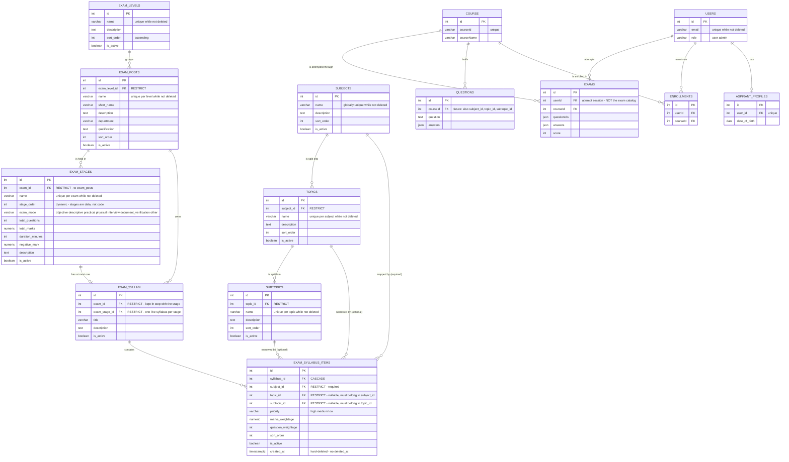

# Exam and Syllabus Architecture

Two independent structures joined by a syllabus.

| Structure | Tables |
|---|---|
| **Exam** | `exam_levels` → `exam_posts` → `exam_stages` |
| **Academic** | `subjects` → `topics` → `subtopics` |
| **Bridge** | `exam_syllabi` (one per stage) → `exam_syllabus_items` |

## Why the academic rows are global

"Indian Constitution" is one subject row. Every exam reaches it through a syllabus item — there is no per-exam copy such as "SI Constitution" or "LDC Constitution".

This is the point of the design. Without it, the same subject exists once per exam, and any question tagged to a subject can only ever be counted against one exam's analytics.

## Mapping depth

A syllabus item can map at three depths, which is why `topic_id` and `subtopic_id` are nullable.

| Item specifies | Meaning |
|---|---|
| subject only | the whole subject is in the syllabus |
| subject + topic | only that topic |
| subject + topic + subtopic | only that subtopic |

## Conventions

**Audit block.** Every table except `exam_syllabus_items` carries the same six columns, omitted from the diagram for readability:

```
created_at, updated_at, deleted_at     -- soft delete
created_by, updated_by, deleted_by     -- user ids, taken from the JWT
```

**`exam_syllabus_items` is hard-deleted.** It's a mapping, not a record worth keeping once it leaves a syllabus.

**Uniqueness uses partial indexes**, for two reasons. A soft-deleted row shouldn't reserve a name forever. And on the item table, Postgres treats NULLs in a unique index as distinct, so the nullable `topic_id` / `subtopic_id` combination needs three indexes rather than one.

## Naming: `exams` vs `exam_posts`

These are different things and both are live.

- **`exams`** — an attempt session. One row per user's run through a set of questions. Already exists.
- **`exam_posts`** — the catalog entry. The exam as a thing that exists before anyone sits it.

The catalog entity is called `exam_posts` precisely because `exams` was already taken.

## Diagram



## Tables in this diagram

**New — this work**

`exam_levels`, `exam_posts`, `exam_stages`, `subjects`, `topics`, `subtopics`, `exam_syllabi`, `exam_syllabus_items`

**Existing — shown for context only**

`users`, `exams`, `course`, `questions`, `enrollments`, `aspirant_profiles`

## Open items

Not covered by this diagram, but required by the admin designs:

- `batches` — Students list column and filter, student profile, dashboard card, its own sidebar section
- `subscriptions` — dashboard card, student profile panel
- **Per-answer log** — one row per answer, tagged by subject. `questions` is noted as gaining `subject_id` / `topic_id` / `subtopic_id`, which makes subject-level analytics *possible*, but nothing yet records individual answers. The Weak Subjects panel depends on it.
- **PSC ID** — a column on `users`, or possibly on `aspirant_profiles`
- **Activity tracking** — Daily Active Users chart, student profile Activity tab